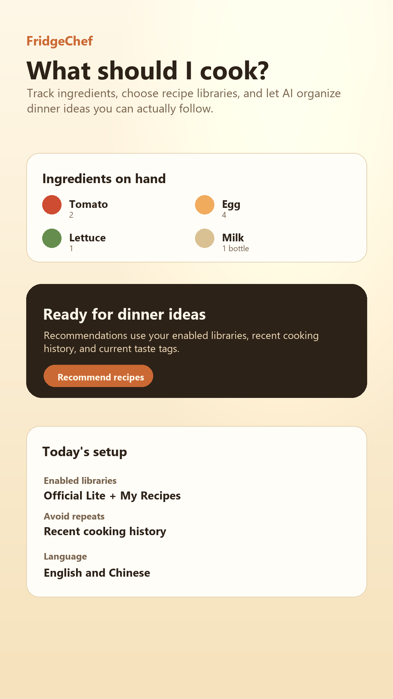
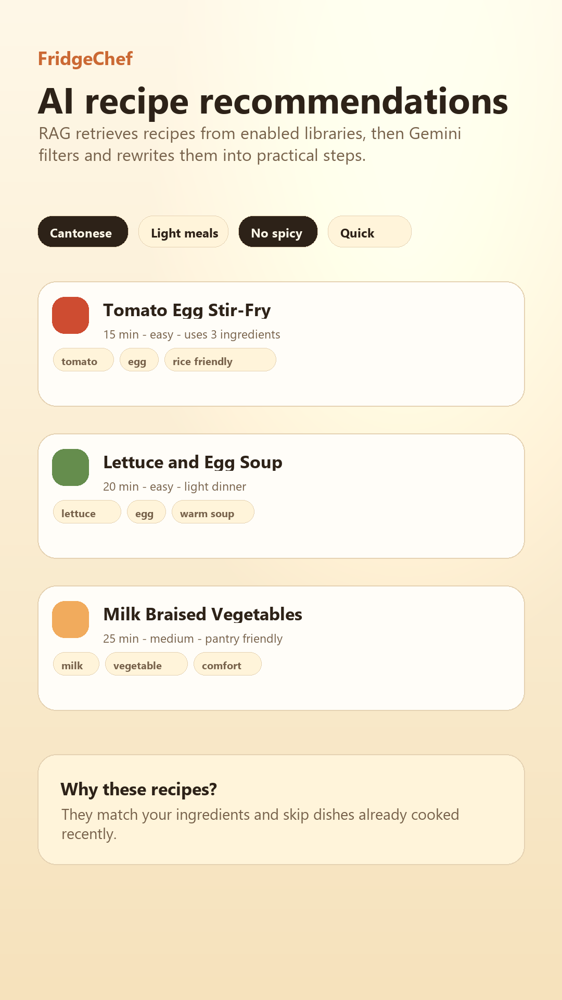
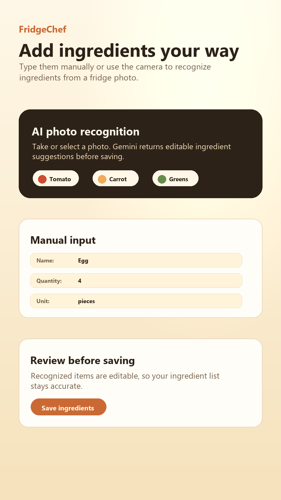
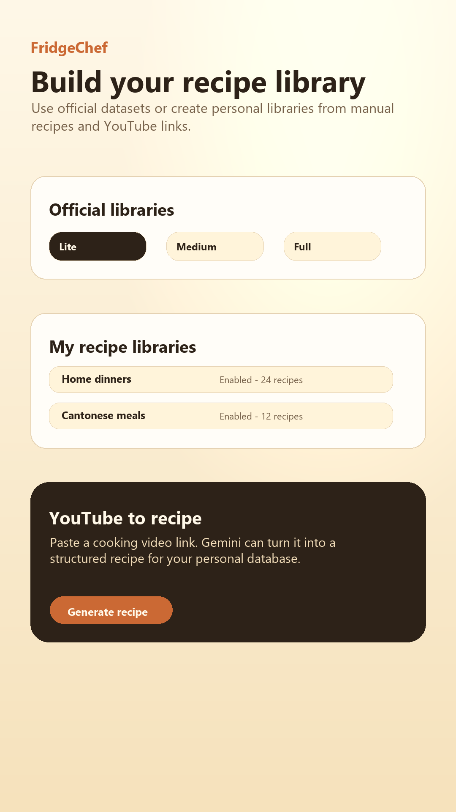

# 是啊！吃什么 / FridgeChef

> 根据冰箱里的食材、自己的菜谱库和当前口味，帮你决定今天吃什么。

[中文说明](#这个软件是什么) · [English overview](#english-overview) · [隐私政策](PRIVACY.md) · [数据包格式](docs/dataset-pack-v1.md) · [ONNX RAG](docs/onnx-rag.md)

“是啊！吃什么”是一款 Android 优先、本地优先的智能菜谱应用。它不是单纯展示一张菜谱列表，而是把用户已有的食材、启用的菜谱库、最近做过的菜和本次口味要求组合起来，先在手机上检索合适的候选菜谱，再由 Gemini 整理成更容易直接照着做的方案。

<p align="center">
  
  
  
  
</p>

## 这个软件是什么

很多时候，用户并不缺菜谱，而是缺少一个能结合当前情况做决定的工具：冰箱里只剩这些东西、今晚只有半小时、不想吃辣、最近已经吃过同一道菜——这时到底做什么？

FridgeChef 围绕这个问题提供一条完整流程：

```text
冰箱食材 + 人数/时间/忌口 + 本次口味 + 最近做饭记录
                            │
                            ▼
             手机本地检索已启用的菜谱库
          ┌─────────────────┴─────────────────┐
          │                                   │
  预向量化官方 DatasetPack           用户自己的菜谱库
  BGE-M3 查询向量 + topK             本机向量缓存 / 文本回退
          └─────────────────┬─────────────────┘
                            ▼
                    得到候选菜谱
                            ▼
          用户同意后，由 Gemini 过滤并整理步骤
                            ▼
                   可直接执行的做饭方案
```

如果本地 ONNX 模型还没有安装或当前设备无法运行，应用仍可回退到本地文本检索；如果用户没有输入食材，也可以从启用的菜谱库中生成随机灵感。

## 主要功能

- **冰箱食材管理**：手动添加、编辑和删除食材，也可以拍照后让 Gemini 识别。
- **本地菜谱检索**：根据食材、人数、最长时间、难度、忌口和临时口味标签检索候选菜谱。
- **官方菜谱库**：下载安装已经生成好 BGE-M3 向量的 DatasetPack，不需要在手机上重新向量化全部官方数据。
- **我的菜谱库**：新建不同主题的私人菜谱库，手动录入菜谱，或从 YouTube 链接生成菜谱草稿。
- **个人菜谱向量化**：安装 ONNX 模型后，个人菜谱可在本机按需生成并缓存 embedding；模型不可用时使用文本匹配。
- **Gemini 推荐整理**：过滤无效候选，结合用户要求补充匹配理由、缺少食材和清晰步骤。
- **最近做过的菜**：记录烹饪历史，并在一段时间内减少重复推荐。
- **中英文界面**：默认跟随系统语言，也可以在设置中固定为中文或英文。
- **本地优先**：食材、私人菜谱、历史、设置、索引和模型都保存在应用私有目录。

## 菜谱库与模型

### 官方菜谱库

官方库以 DatasetPack 形式发布，核心内容是：

```text
dataset-pack.json
files/
  vectors.f32       # 已预先生成的 float32 向量
  metadata.jsonl    # 菜谱文本和元数据
```

应用读取官方索引后，可以安装不同规模的数据集。推荐只使用当前启用的库，不会因为某个数据集已经下载就自动把它加入检索。

默认数据源：

- Dataset index：`https://huggingface.co/datasets/Yatorou/ChiShenMe/resolve/main/dataset-index.json`
- DatasetPack 规范：[docs/dataset-pack-v1.md](docs/dataset-pack-v1.md)

### BGE-M3 查询模型

官方 DatasetPack 已经向量化，但手机仍需要同一个 embedding 模型把用户的查询转换成向量。应用使用 `BAAI/bge-m3` 的 ONNX 模型完成这一步。

默认模型包：

`https://huggingface.co/datasets/Yatorou/ChiShenMe/resolve/main/models/bge-m3-query-onnx/model-pack.json`

完整模型包约为 **2.29 GB**。建议在稳定 Wi-Fi 下下载，并至少预留 3 GB 可用空间。模型下载支持 HTTP Range 分块和跨重启断点续传。

## 下载与安装安全

菜谱包和模型包不会直接写入正式安装目录。当前安装流程会：

1. 校验 manifest 格式、文件角色、数量和声明大小。
2. 只允许无内嵌凭据的 HTTPS 地址。
3. 拒绝绝对路径、路径穿越、反斜杠和目录越界写入。
4. 将文件下载到隔离的 `.download` 暂存目录。
5. 使用流式 SHA-256 校验每个文件，避免把大文件整体读入内存。
6. 所有文件通过校验后才写入最终 manifest、切换正式目录并登记安装。
7. 安装提交失败时恢复原版本；损坏文件会被删除，网络中断产生的暂存文件只用于断点续传。

模型包支持 16 MB Range 分块、超时和自动重试。DatasetPack 当前具备 HTTPS、路径、大小、SHA-256 和暂存安装保护，但暂未实现跨重启断点续传。

## Gemini 与隐私

应用没有开发者自建的业务后端。Gemini API Key 由用户自己提供，并保存在系统 SecureStore 中；所有 Gemini 请求统一通过一个网络客户端发送，Key 放在 `x-goog-api-key` 请求头中，不写入 URL。

第一次使用 AI 功能前，应用会显示显著的数据披露。只有用户同意并主动使用相应功能时，才会把完成该次请求所需的数据直接发送给 Google，例如：

- 用户选择的食物照片；
- 当前食材、饮食偏好和候选菜谱；
- 需要整理的菜谱文本；
- 用户主动提交的 YouTube 链接；
- 用于验证请求的 Gemini API Key。

应用不会自动上传完整的本地菜谱库。用户可以在“设置 → 隐私政策与数据披露”中撤回同意，撤回后新的 Gemini 请求会被阻止。

详细说明：

- [隐私政策与数据披露](PRIVACY.md)
- [Google Play Data Safety 填写草案](docs/google-play-data-safety.md)

## 用户使用顺序

1. 在“设置”中保存自己的 Gemini API Key。
2. 打开“菜谱库”，下载并启用一个官方库，或者新建并启用“我的菜谱库”。
3. 第一次使用向量推荐时，在推荐页下载 BGE-M3 ONNX 模型。
4. 在“冰箱”中录入食材，也可以不录入食材直接获取随机灵感。
5. 选择人数、时间、难度、忌口和本次口味，生成推荐。
6. 做完后记录为“最近做过”，后续推荐会尽量避免短期重复。

不配置 Gemini Key 时，用户仍可管理食材和本地菜谱库；拍照识别、YouTube 菜谱提取和最终 AI 整理功能需要联网及有效的 Gemini Key。

## 技术结构

| 模块 | 实现 |
| --- | --- |
| 客户端 | React Native 0.86 + Expo SDK 57 + TypeScript |
| 导航 | React Navigation |
| 本地数据 | Expo SQLite、AsyncStorage |
| 密钥存储 | Expo SecureStore |
| 本地 embedding | ONNX Runtime React Native + BGE-M3 ONNX |
| 官方向量检索 | `vectors.f32` 本地 topK 扫描 + `metadata.jsonl` |
| 个人菜谱检索 | 本机 embedding 缓存，必要时回退文本检索 |
| 云端 AI | Google Gemini API |
| 文件完整性 | HTTPS、受限路径、声明大小、流式 SHA-256、暂存目录 |

主要目录：

```text
src/
  application/     应用启动、Provider 和导航组合
  ai/              Gemini 客户端、提示词和返回解析
  datasets/        DatasetPack 下载、校验和注册
  db/              SQLite 数据库与 Repository
  downloads/       URL、路径、Range 和 SHA-256 公共安全逻辑
  features/        按首页、食材、菜谱、推荐、历史和设置组织的业务模块
    */screens/     各业务模块页面
    */hooks/       仅属于该业务的 React hooks
    */services/    仅属于该业务的计算与服务
  privacy/         AI 数据同意状态与首次披露
  rag/             ONNX embedding、向量库、元数据和个人 RAG
  shared/          跨业务复用的组件和主题
  storage/         设置与推荐缓存
docs/               数据格式、RAG 和上架说明
tests/              下载安全、网络层和发布策略测试
android/            Android 原生工程
```

## 本地开发

### 环境要求

- Node.js 22 或兼容版本
- npm
- JDK 17
- Android SDK 36
- Android 真机或模拟器

项目包含 `onnxruntime-react-native` 原生模块，因此不能只用 Expo Go，必须构建 Development Build。

### 安装依赖

```powershell
cd D:\androidCode\ChiShenMe\mobile
npm install
```

### 连接 Android 设备并运行

```powershell
npx expo run:android
```

也可以使用仓库脚本，并按本机环境传入 JDK：

```powershell
powershell -ExecutionPolicy Bypass -File scripts/android-device-dev.ps1 `
  -AndroidSdk "$env:LOCALAPPDATA\Android\Sdk" `
  -JavaHome "C:\path\to\jdk-17"
```

原生 Development Build 已安装后，日常启动 Metro：

```powershell
npm run start:dev-client
```

### 检查与测试

```powershell
npm test
npm run test:types
npm run check
```

测试覆盖 manifest 校验、HTTPS 与路径约束、SHA-256、Range 断点续传、Gemini Key 传输、安装提交顺序以及 Release 权限策略。

### Release 签名

复制示例文件并填写自己的上传密钥信息：

```powershell
Copy-Item android/key.properties.example android/key.properties
```

`android/key.properties` 和 keystore 不应提交到 Git。配置完成后可运行：

```powershell
cd android
.\gradlew.bat bundleRelease
```

## 当前边界

- ONNX 模型包约 2.29 GB，下载、SHA-256 校验和首次加载都需要时间；中低端设备可能不适合本地运行 BGE-M3。
- 官方向量检索当前为 JS 分块扫描，不是 HNSW/IVF 等 ANN 索引；超大数据集的延迟仍需优化。
- 文本回退检索在已经找到足够候选时，会在扫描 10,000 条官方 metadata 记录后提前返回。
- DatasetPack 暂未实现跨重启断点续传，模型包已经支持。
- Gemini 功能依赖网络、Google 服务可用性、模型权限及用户自己的 API 配额。

后续适合继续优化的方向包括：原生 ANN 向量索引、dataset 断点续传、cross-encoder rerank、后台下载，以及更完善的端到端真机测试。

## 相关文档

- [源码目录与依赖规则](src/README.md)
- [DatasetPack v1](docs/dataset-pack-v1.md)
- [ONNX RAG](docs/onnx-rag.md)
- [Android 本地 Embedding](docs/android-local-embedding.md)
- [RAG 数据预处理](docs/rag-preprocessing.md)
- [隐私政策](PRIVACY.md)
- [Google Play Data Safety](docs/google-play-data-safety.md)
- [商店素材说明](store-listing/default/README.md)

---

## English overview

FridgeChef is an Android-first, local-first cooking assistant. It combines the ingredients on hand, enabled recipe libraries, cooking history, and current preferences to retrieve candidate recipes on the device. An optional BGE-M3 ONNX model provides local vector search, while text search remains available as a fallback. After a prominent user consent step, Gemini can recognize ingredients from photos, extract recipe drafts from YouTube links, and refine retrieved candidates into practical cooking plans.

Official DatasetPacks are pre-vectorized. Personal recipes can be embedded and cached locally when the ONNX model is available. Ingredients, recipes, history, settings, indexes, and models stay in app-private storage. Only the data required for an AI request is sent directly to Google when the user actively invokes that feature.

See the Chinese sections above for setup, architecture, security, privacy, testing, and current limitations.
