# Phase 1 review package

Evidence for parent issue #3 (accessible Android UI foundation and Home flow), gathered for #20. The review asks the product owner to approve or reject the Phase 1 visual direction before Phase 2 begins.

**Status: waiting for the product owner's decision. Three Phase 1 regressions are open (see [Remaining failures](#remaining-failures)).**

## 1. Implementation under review

- Branch: `feat/systematic-improvements`
- Reviewed commit: `ac8c176c166cf9fc52f58bacdd8848ff8f1dc927`
- Base: `main` at `f4f3933e89037141a6cd14fb09e9d8b892e85b2f` (36 commits on the branch)

Phase 1 sub-issue commits:

| Issue | Commits |
| --- | --- |
| #15 UI foundation | `eb1e8f2`, `c61049b`, `81c0517`, `b566b6c`, `a85dd1e`, `2f56287`, `bf4b6f6` |
| #16 Bottom navigation | `ec61796`, `69a9ca4` |
| #17 Home recommendation entry | `8ee0853`, `921a0e2`, `28977e3` |
| #18 Passive Recommendations | `4bcb231` |
| #19 Accessibility and large text | `ac8c176` |

Branch commits from before the sub-issues, which Phase 1 audited rather than replaced: `33432ef` (adaptive semantic theme), `0ce5659` (primary navigation), `6f15c6f`, `3c3c86d`, `78d39d8`, `5291d0a`, `021de8f`, `4d4e2a8` (Home), `b65a3ab` (tab label), `3a860b1` (system theme sync), `3431b9d`, `a212e37`, `906d5b6` (readiness and i18n). The remaining branch commits (storage, security, migrations, data controls) are outside the Phase 1 UI scope.

## 2. Runnable state

- Target: Android emulator, Google APIs Play Store system image, Android 17 (API 37), x86_64, 1080×2400 at 420 dpi (1 dp = 2.625 px)
- Build: the development build (`npm run android`) of the reviewed commit, with JavaScript served by Metro. No native dependencies changed after that APK was built (later `package.json` changes are test-only devDependencies).
- App state: no Gemini API key, no AI data consent, and BGE-M3 not verified. A recipe source is available (the readiness row reports `Ready`). Screenshots named `*-with-ingredient*` and the setup dialog show one synthetic Confirmed Ingredient ("eggs", quantity 1).
- Date: 2026-09-16

## 3. Screenshots

All screenshots are in [`screenshots/`](screenshots/).

### 3.1 Home and the four destinations (default font)

| | English light | English dark | 中文 light | 中文 dark |
| --- | --- | --- | --- | --- |
| Home | 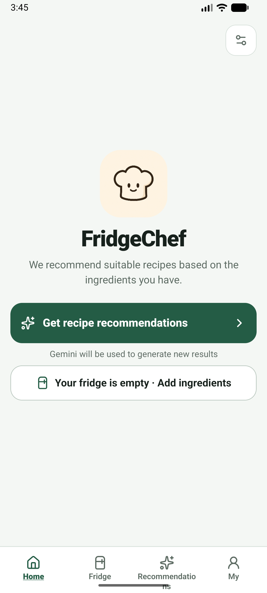 | 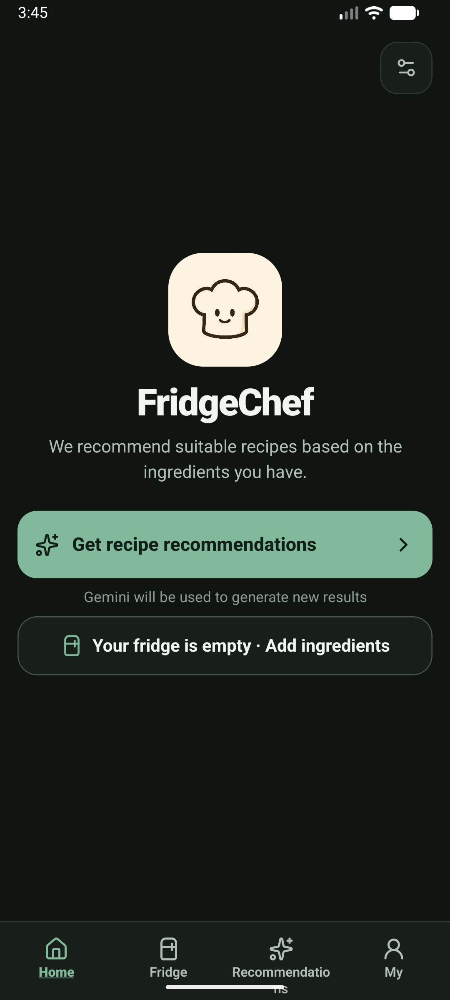 | 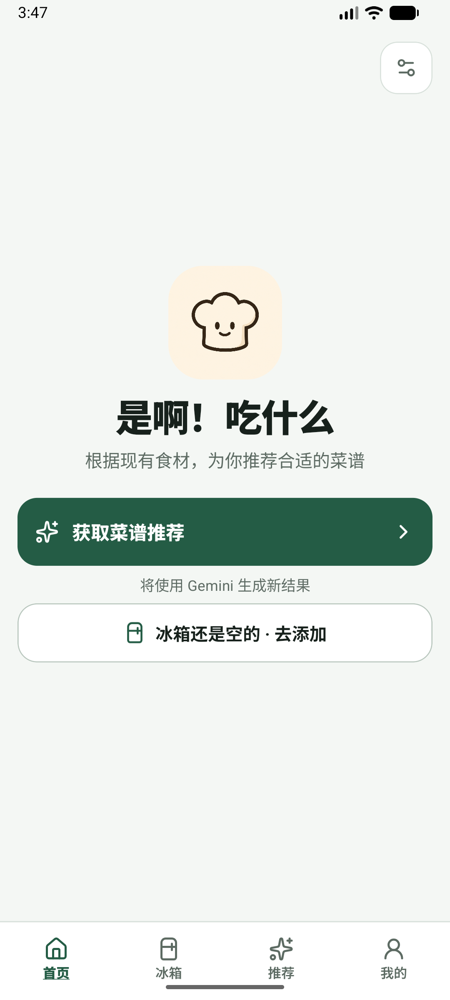 | 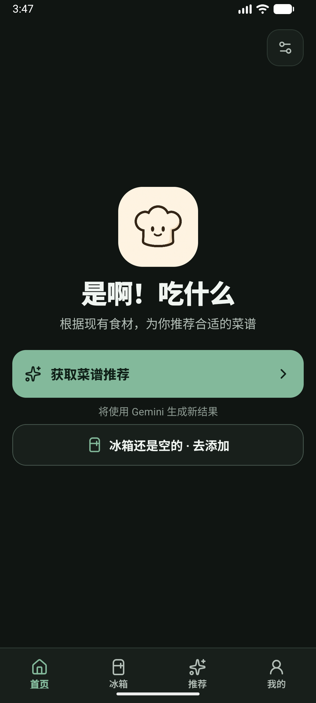 |
| Fridge | 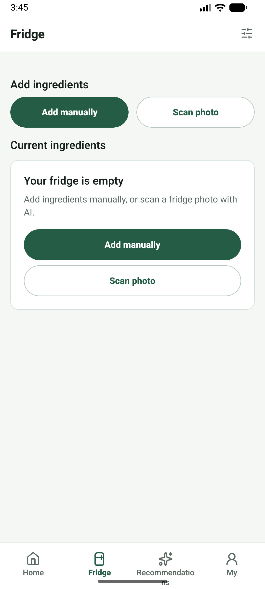 | 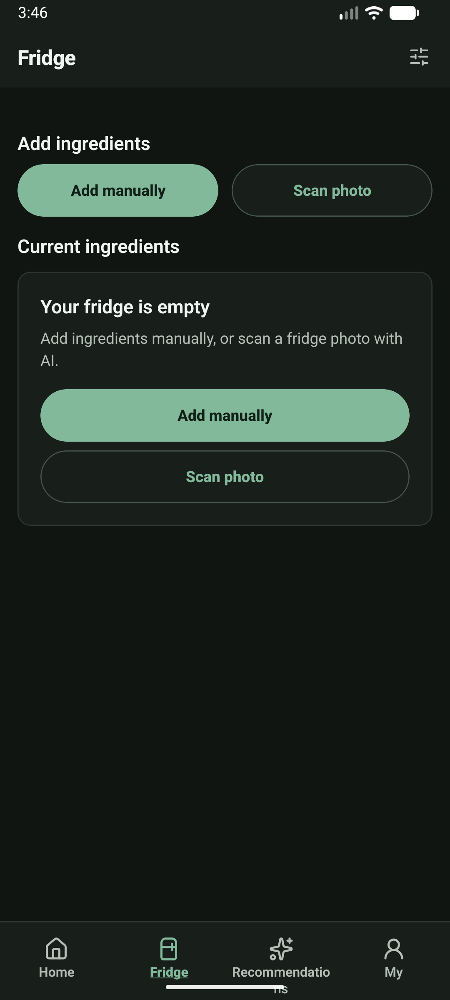 | 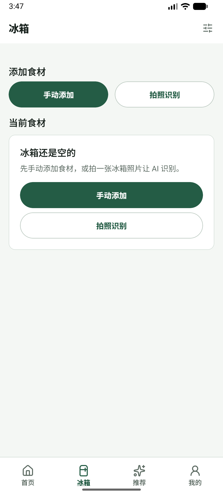 | 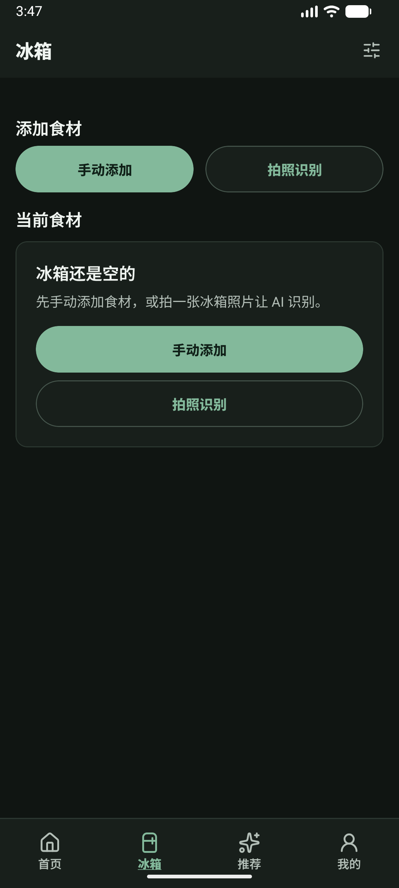 |
| Recommendations | 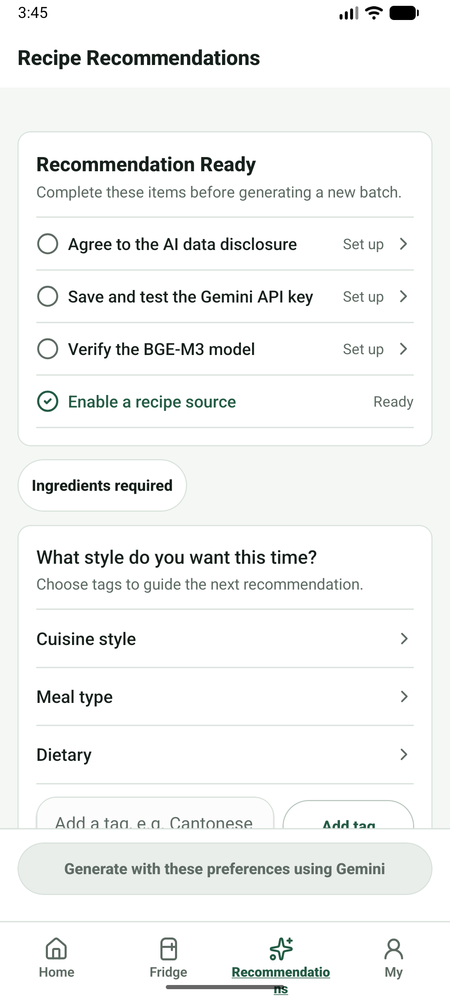 | 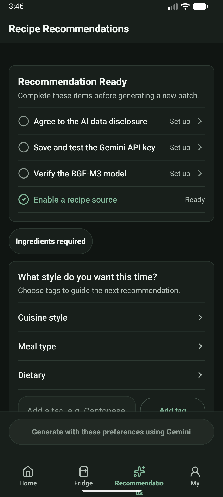 | 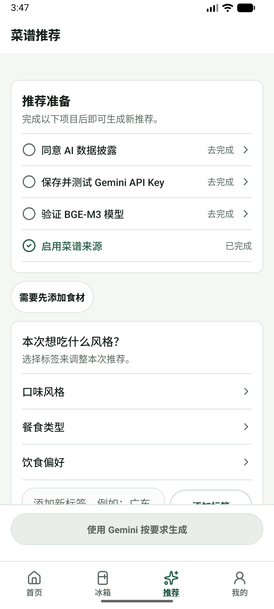 | 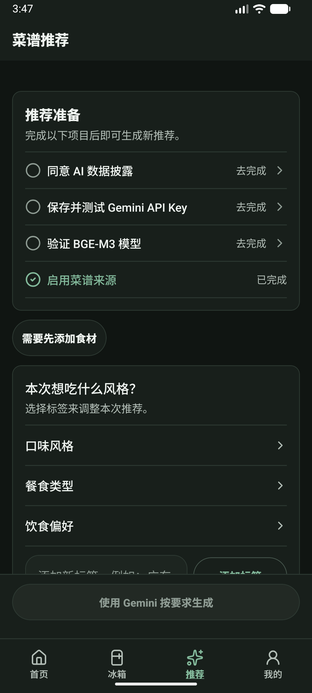 |
| My | 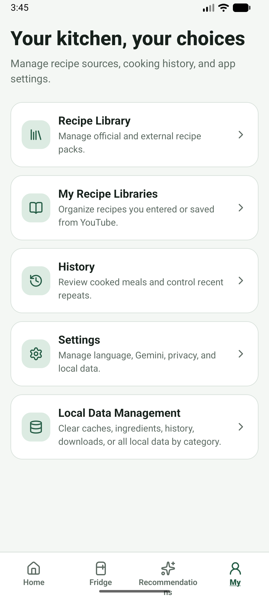 | 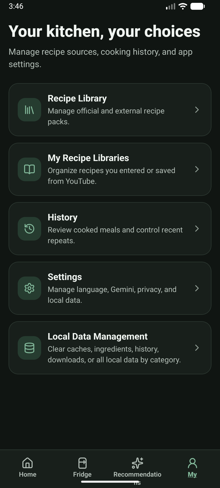 | 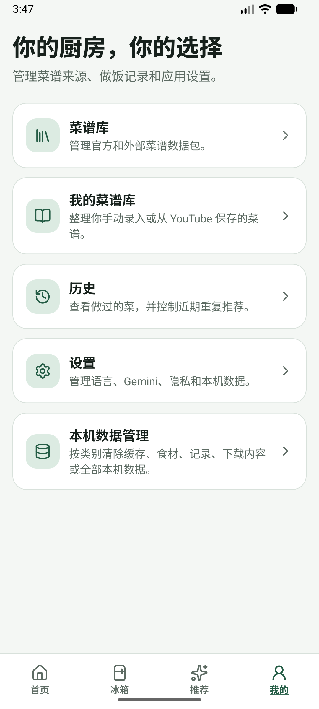 | 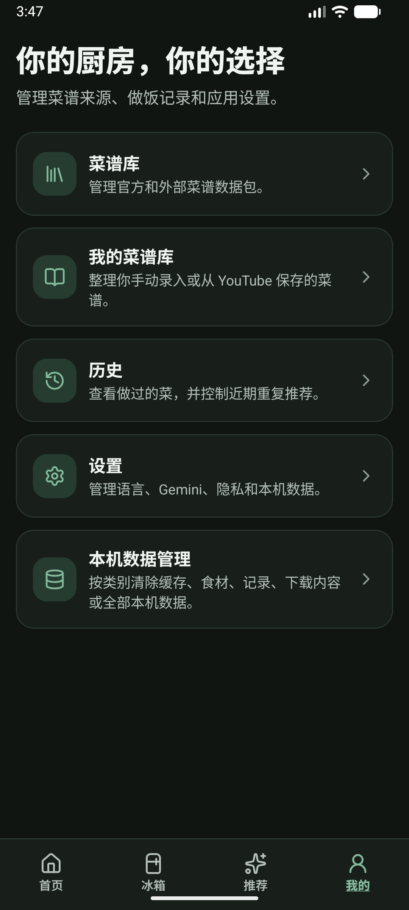 |

### 3.2 Recommendations states

| State | Screenshot |
| --- | --- |
| Not ready, no Confirmed Ingredients (checklist, "Ingredients required", disabled Gemini action) | [en light](screenshots/en-light-recommendations.png), [中文 dark](screenshots/zh-dark-recommendations.png) |
| Not ready, one Confirmed Ingredient | [en light](screenshots/en-light-recommendations-with-ingredient.png), [en dark](screenshots/en-dark-recommendations-with-ingredient.png) |
| Restored after the app went to the background and returned | [中文 light](screenshots/zh-light-recommendations-restored.png) |
| 200% font | [en light](screenshots/en-light-recommendations-font200.png) |

The loading, error, cached and populated states need a live Gemini key, and this review deliberately used none. Rendered tests cover those states instead (section 4, `navigation-render.jest.tsx`: "passively presents cached Recommendations…", "announces generation progress and a Gemini failure…", "presents populated English Recommendations…"). They have no device screenshots. See limitation L1.

### 3.3 Home states and dialogs

| State | Screenshot |
| --- | --- |
| One Confirmed Ingredient: "View fridge · 1 ingredient" | [en light](screenshots/en-light-home-with-ingredient.png) |
| Get recipe recommendations while not Recommendation Ready: "A few steps remain" | [en light](screenshots/en-light-home-setup-dialog.png) |
| Empty fridge dialog at 200% | [en light](screenshots/en-light-home-dialog-font200.png) |
| Home at 200% | [en light](screenshots/en-light-home-font200.png) |
| Fridge and My at 200% | [Fridge dark](screenshots/en-dark-fridge-font200.png), [My dark](screenshots/en-dark-my-font200.png) |

## 4. Automated results (reviewed commit)

| Command | Result |
| --- | --- |
| `npx tsc --noEmit` | Pass (exit 0) |
| `npx tsc --noEmit -p tsconfig.test.json` | Pass (exit 0) |
| `node --experimental-strip-types --test` | 61 total: 61 pass, 0 fail, 0 skipped, 0 cancelled, 0 todo |
| `npx jest --runInBand` | 3 suites, 25 tests: 25 pass, 0 fail, 0 skipped, 0 snapshots |

Combined `npm test` result: 86 tests, 86 pass, 0 fail, 0 skipped.

## 5. Manual accessibility results

The checks follow [`docs/accessibility-phase1-checks.md`](../accessibility-phase1-checks.md). On-device observations come from screenshots and the Android accessibility node tree (`uiautomator dump`) on the emulator above.

| Area | Result | Evidence |
| --- | --- | --- |
| TalkBack labels and roles | **Partial pass** | The node tree names every control: tabs `Home`/`Fridge`/`Recipe Recommendations`/`My` (`首页`/`冰箱`/`菜谱推荐`/`我的`); readiness rows read `Agree to the AI data disclosure. Set up` and `Enable a recipe source. Ready`; the Home actions and the Fridge `Edit eggs` action are named. When TalkBack was on, its first utterance was `Settings. Button`. Rendered tests verify roles and states. On this emulator TalkBack ignored injected swipe and keyboard navigation, so nobody has done a full gesture walk-through with speech. See L2. |
| Focus order | **Partial pass** | Home traversal order in the node tree is Settings → icon → product name → subtitle → Get recipe recommendations → Gemini hint → fridge action → tabs, which matches the checklist. TalkBack placed initial focus on Settings. A live swipe order is not recorded (L2). |
| 200% font scale | **Fail** | Home, the dialogs, the readiness checklist, Fridge and My wrap without clipping. The Recommendations tab label breaks mid-word across three lines and runs into the gesture bar (R1), and the Recommendations header is cut off as `Recipe Recommendatio…` (R2). |
| Minimum target size (48 dp) | **Fail** | On Home: Settings 48×48 dp, primary action 62 dp tall, fridge action 54 dp tall, each tab 103×54 dp. On Fridge, the header Settings button is 36×48 dp on screen (95×126 px) (R3). |
| Contrast | Pass | `ui-foundation-contract.test.ts`: "text stays readable at WCAG AA contrast in light and dark appearances". Screenshots show legible text in both appearances. The disabled Gemini action is low-contrast by design and exempt from the contrast requirement. |
| Non-color status | Pass | Readiness rows show an icon (circle or check) plus the text `Set up`/`Ready`. The active tab is bold and underlined in addition to its color. Selected tags show ✓ (rendered test). |
| Chinese and English | Pass | The glossary product names 是啊！吃什么 and FridgeChef appear on Home. English screens show no Chinese text, and Chinese screens show no raw keys. |
| Light and dark | Pass | Every destination is captured in both appearances with the same gray-white or near-black surfaces and dark-green accents. |

## 6. Gemini is not called on open or restore

1. **Code path.** The only Gemini request is `fetch` in `src/ai/geminiClient.ts`. On focus, `RecommendationsScreen` refreshes readiness, which reads stored state only. It generates only when a one-shot `generationRequestId` route parameter is present. The screen clears that parameter and records it in a ref, so returning to the screen does not replay it.
2. **Rendered tests (passing).** "passively restores Recommendations without replaying a generation request", "generates once only after the explicit Home action and does not replay on focus", "passively presents cached Recommendations and identifies them as cached", "waits for an explicit retry after a Gemini failure", "requires an explicit retry after an invalid Gemini response".
3. **Device observation.** Network counters (rx/tx bytes) for the app's UID:
   - Idle for 20 s: +2.4 KB rx, +7.5 KB tx (Metro development traffic).
   - Opening Recommendations 3 times over about 40 s: +4.1 KB rx, +12.4 KB tx, the same rate as idle.
   - Backgrounding the app on Recommendations and restoring it: +1.9 KB rx, +4.9 KB tx.
   - No loading state appeared.

   This device is also not Recommendation Ready, so generation was blocked there anyway. The rendered tests are the evidence for the Ready case.

## Remaining failures

| ID | Classification | Failure | Reproduction |
| --- | --- | --- | --- |
| R1 | Phase 1 regression | The English Recommendations tab label wraps mid-word (`Recommendatio` / `ns`) at the **default** font scale, and at 200% it spans three lines and overlaps the gesture bar. The 103 dp tab is too narrow for "Recommendations" at 12 sp bold. Label from `b65a3ab`; `numberOfLines={3}` from `69a9ca4`. | English, any appearance, any tab. See `en-light-fridge.png`, `en-light-home-font200.png`. |
| R2 | Phase 1 regression | At 200% the Recommendations header title is cut off with an ellipsis (`Recipe Recommendatio…`) instead of wrapping. | English, font scale 2.0, open Recommendations. See `en-light-recommendations-font200.png`. |
| R3 | Phase 1 regression | The Fridge header Settings button is 36 dp wide on screen. `minWidth: 48` with `marginRight: -12` in `FridgeScreen.tsx` (`headerSettingsButton`, from `b566b6c`) is clipped by the native header container. | Open Fridge and inspect the node bounds of `Settings`: `[943,73][1038,199]` px at 420 dpi. |
| P1 | Pre-existing issue | The quantity field on Add Ingredient exposes its placeholder `4` as its accessibility description, not the visible `Quantity` label. | Fridge → Add manually, then inspect the node tree. |
| L1 | Out-of-scope limitation | No device screenshots of the loading, error, cached or populated Recommendations states. They need a live Gemini key, and completing Recommendation Ready is out of scope for #3 (ADR-0003: generating needs Gemini and BGE-M3). Rendered tests cover these states. | — |
| L2 | Out-of-scope limitation | No full TalkBack gesture walk-through with speech. TalkBack on the emulator ignores injected `adb` swipes and keyboard shortcuts, so this needs a person on a physical device or emulator. It is a verification gap, not an observed failure; the product owner may require it before approval. | Enable TalkBack, then run `adb shell input swipe …`: focus does not move. |

## 7. Privacy check

This package contains no Gemini credential (none was configured), no Personal Recipe content, and no local machine paths or device serials. The only ingredient shown is the synthetic test value "eggs".

## 8. Decision

- **Product owner approval of the Phase 1 visual direction:** Pending, not yet given.
- **Phase 2 may proceed:** No, not until the product owner decides and R1–R3 are fixed or explicitly accepted.
- Parent issue #3 stays open and unmodified until the product owner makes the acceptance decision.
